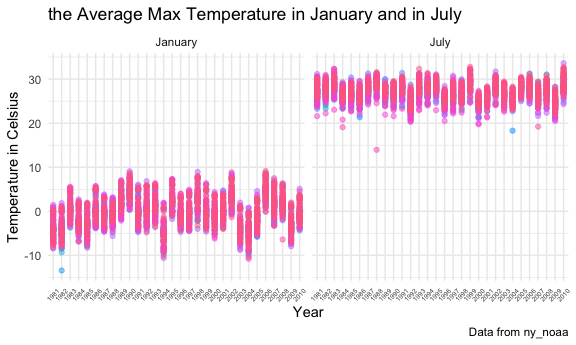

P8105 homework 3
================
Shunyi Zhang

This is my solution for homework 3.

# Problem 1

## Get data

``` r
data("instacart")
```

## Explore data

The dimension of this data is 1384617, 15. It has 1384617 rows and 15
columns. It contains variables add\_to\_cart\_order, aisle, aisle\_id,
days\_since\_prior\_order, department, department\_id, eval\_set,
order\_dow, order\_hour\_of\_day, order\_id, order\_number, product\_id,
product\_name, reordered, user\_id.

It has variable for user `user_id`. Variables for orders are `order_id`,
`order_dow`, and `order_hour_of_day`. Variables for products are
`product_id` and `product_name`. There are also variables about aisle
and department, `aisle`, `aisle_id`, `department`, and `department_id`.

## Explore aisle

``` r
instacart %>% 
  count(aisle) %>% 
  arrange(desc(n))
```

    ## # A tibble: 134 x 2
    ##    aisle                              n
    ##    <chr>                          <int>
    ##  1 fresh vegetables              150609
    ##  2 fresh fruits                  150473
    ##  3 packaged vegetables fruits     78493
    ##  4 yogurt                         55240
    ##  5 packaged cheese                41699
    ##  6 water seltzer sparkling water  36617
    ##  7 milk                           32644
    ##  8 chips pretzels                 31269
    ##  9 soy lactosefree                26240
    ## 10 bread                          23635
    ## # … with 124 more rows

There are 134 aisles. Among them, the aisle of fresh vegetables is the
most items ordered from.

## Make plot

``` r
instacart %>% 
  count(aisle) %>% 
  filter(n > 10000) %>% 
  mutate(
    aisle = factor(aisle),
    aisle = fct_reorder(aisle,n)
  ) %>% 
  ggplot(aes(x = aisle, y = n)) + 
  geom_point() + 
  theme(axis.text.x = element_text(angle = 90, vjust = 0.5, hjust = 1))
```


## Make table: popular item

``` r
instacart %>% 
  filter(
    aisle %in% c("baking ingredients", "dog food care", "packaged vegetables fruits")
  ) %>% 
  group_by(aisle) %>% 
  count(product_name) %>% 
  mutate(
    rank = min_rank(desc(n))
  ) %>% 
  filter(rank <= 3) %>% 
  arrange(aisle, rank) %>% 
  knitr::kable()
```

| aisle                      | product\_name                                 |    n | rank |
| :------------------------- | :-------------------------------------------- | ---: | ---: |
| baking ingredients         | Light Brown Sugar                             |  499 |    1 |
| baking ingredients         | Pure Baking Soda                              |  387 |    2 |
| baking ingredients         | Cane Sugar                                    |  336 |    3 |
| dog food care              | Snack Sticks Chicken & Rice Recipe Dog Treats |   30 |    1 |
| dog food care              | Organix Chicken & Brown Rice Recipe           |   28 |    2 |
| dog food care              | Small Dog Biscuits                            |   26 |    3 |
| packaged vegetables fruits | Organic Baby Spinach                          | 9784 |    1 |
| packaged vegetables fruits | Organic Raspberries                           | 5546 |    2 |
| packaged vegetables fruits | Organic Blueberries                           | 4966 |    3 |

## Makle table: mean hour

``` r
instacart %>% 
    filter(
      product_name %in% c("Pink Lady Apples", "Coffee Ice Cream")
    ) %>% 
    group_by(
      product_name, order_dow
    ) %>% 
    summarize(
      mean_hour = mean(order_hour_of_day)
    ) %>% 
    pivot_wider(
        names_from = order_dow,
        values_from = mean_hour
    ) %>% 
  rename(
    "Sunday" = '0',
    "Monday" = '1', 
    "Tuesday" = '2', 
    "Wednesday" = '3', 
    "Thursday" = '4', 
    "Friday" = '5', 
    "Saturday" = '6'
  ) %>% 
  knitr::kable()
```

    ## `summarise()` regrouping output by 'product_name' (override with `.groups` argument)

| product\_name    |   Sunday |   Monday |  Tuesday | Wednesday | Thursday |   Friday | Saturday |
| :--------------- | -------: | -------: | -------: | --------: | -------: | -------: | -------: |
| Coffee Ice Cream | 13.77419 | 14.31579 | 15.38095 |  15.31818 | 15.21739 | 12.26316 | 13.83333 |
| Pink Lady Apples | 13.44118 | 11.36000 | 11.70213 |  14.25000 | 11.55172 | 12.78431 | 11.93750 |

# Problem 2

## Get data

``` r
accel_df = 
  read_csv("./data/accel_data.csv") %>% 
  janitor::clean_names() %>% 
  pivot_longer(
    starts_with("activity"),
    names_to = "min_activity",
    values_to = "count_activity",
    names_prefix = "activity_"
  ) %>% 
  mutate(
    day = as.factor(day), 
    day_id = as.integer(day_id), 
    week = as.integer(week), 
    min_activity = as.double(min_activity)
  ) %>% 
  mutate(
    weekend_vs_weekday = recode(
      day, 
      Monday = "weekday", 
      Tuesday = "weekday", 
      Wednesday = "weekday", 
      Thursday = "weekday", 
      Friday = "weekday", 
      Saturday = "weekend", 
      Sunday = "weekend" 
    )
  ) %>% 
  mutate(
    day = factor(
      day, levels = c(
        "Monday","Tuesday","Wednesday","Thursday","Friday","Saturday","Sunday"
      )
    )
  ) %>% 
  relocate("day_id", "week", "day", "weekend_vs_weekday") %>% 
  arrange(week, day)
```

    ## Parsed with column specification:
    ## cols(
    ##   .default = col_double(),
    ##   day = col_character()
    ## )

    ## See spec(...) for full column specifications.

After steps of tidying, the clean data has a dimension of 50400, 6.
`day_id` represents the order of day for the study. `week`, `day`, and
`weekend_vs_weekday` provide information about the day of study.
`min_activity` and `count_activity` shows the count of activities at
each minute of the day, recorded by the accelerometers.

## Make table: total activities

``` r
accel_df %>% 
  group_by(week, day) %>% 
  summarise(sum_activity = sum(count_activity)) %>% 
  ggplot(aes(x = day, y = sum_activity, color = week)) +
  geom_point() + 
  facet_grid(week ~ .)
```

    ## `summarise()` regrouping output by 'week' (override with `.groups` argument)


As shown in the graph, there is not a obvious trend between day and
total activities.

## Make plot: activity over a day

``` r
accel_df %>% 
  ggplot(aes(x = min_activity, y = count_activity, color = day )) +
  geom_point(alpha = 0.3, size = 1) +
  geom_line(alpha = 0.3) + 
  labs(
    title = "Activity over the Course of the Day",
    x = "Time of the day",
    y = "Count of Activity",
    caption = "Data from accel_data.csv"
  ) + 
  scale_x_continuous(
    breaks = c(1, 180, 360, 540, 720, 900, 1080, 1260, 1440),
    labels = c("0:01", "3:00", "6:00", "9:00", "12:00", "15:00", "18:00", "21:00", "24:00")
  )
```


Reading from the graph, the time between 10:30pm to 6:00am has the total
count relatively low. This time period should be the time for sleep
having the low amount of activity. Around 9pm, the count of activity
reaches the highest point. It should be the time for some gaming. At
about 7am, 12pm, and 5pm, there are also high volumes of activity
happen. There are about the breakfast, lunch, and dinner time.

# Problem 3

## Get data

``` r
data("ny_noaa")
```

This noaa data contains 2595176 rows and 7 columns. It has a dimension
of 2595176, 7. The snow depth variable has 591786 missing values. It is
about 20% of all observations. The max temperature variable has 1134358
missing values, as well the min temperature variable has 1134420 missing
values. They are both almost taking 50% of all observations.

## Data cleaning, explore snowfall

``` r
ny_noaa_df = 
  ny_noaa %>% 
  janitor::clean_names() %>% 
  separate(date, c("year", "month", "day"), sep = "-") %>% 
  mutate(
    year = as.factor(year), 
    month = as.factor(month), 
    day = as.factor(day), 
    prcp = as.numeric(prcp), 
    tmin = as.numeric(tmin), 
    tmax = as.numeric(tmax), 
    prcp = prcp / 10,
    tmin = tmin / 10,
    tmax = tmax / 10,
    month = month.name[month]
  ) 

ny_noaa %>% 
  count(snow) %>% 
  arrange(desc(n))
```

    ## # A tibble: 282 x 2
    ##     snow       n
    ##    <int>   <int>
    ##  1     0 2008508
    ##  2    NA  381221
    ##  3    25   31022
    ##  4    13   23095
    ##  5    51   18274
    ##  6    76   10173
    ##  7     8    9962
    ##  8     5    9748
    ##  9    38    9197
    ## 10     3    8790
    ## # … with 272 more rows

Among the snowfall variable, 0mm is the most commonly observed value,
means there is not a lot snow in the New York area. Also, there are a
lot missing value.

## Make plot: average max temperature

``` r
ny_noaa_df %>% 
  filter(month%in% c("January", "July")) %>% 
  group_by(id, year, month) %>% 
  summarise(tmax_mean = mean(tmax)) %>% 
  ggplot(aes(x = year, y = tmax_mean, color = id, group = id)) +
  geom_point(alpha = 0.5) +
  facet_grid(. ~ month) +
  theme(axis.text.x = element_text(angle = 45, hjust = 0.5, vjust = 0.5,size = 5), 
        legend.position = "none") +
  labs(
    title = "the Average Max Temperature in January and in July",
    x = "Year",
    y = "Temperature in Celsius",
    caption = "Data from ny_noaa"
  )
```

    ## `summarise()` regrouping output by 'id', 'year' (override with `.groups` argument)

    ## Warning: Removed 7058 rows containing missing values (geom_point).



In general, the average max temperature in January is around 15 to 20
degree lower than the average max temperature in July. There are some
extreme situation happened in 1982 January, 1994 January, 2003 January,
and 1987 July.

## Make plots: tmax vs tmin / snowfall

``` r
tmin_vs_tmax = 
  ny_noaa_df %>% 
  ggplot(aes(x = tmax, y = tmin)) + 
  geom_hex() +
  geom_density2d() +
  theme(legend.position = "right") +
  labs(
    title = "Max tem vs Min tem",
    x = "Max tem in Celsius", 
    y = "Min tem in Celcius"
  )

snowfall_distribution = 
  ny_noaa_df %>% 
  filter(snow > 0 & snow < 100) %>%
  ggplot(aes(x = snow, y = year)) +
  ggridges::geom_density_ridges() + 
  labs(
    title = "the Distribution of snowfall over years",
    x = "Snowfall in mm", 
    y = "Years"
  )

tmin_vs_tmax + snowfall_distribution
```

    ## Warning: Removed 1136276 rows containing non-finite values (stat_binhex).

    ## Warning: Removed 1136276 rows containing non-finite values (stat_density2d).

    ## Picking joint bandwidth of 3.76


